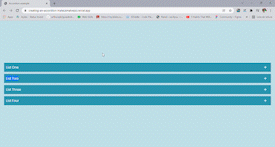

<h4 align="center">
  🚀 Accordion!
</h4>

  
  
  

  

  <a href="#page_with_curl-about">About</a>&nbsp;&nbsp;&nbsp;|&nbsp;&nbsp;&nbsp;
  <a href="#wrench-built-with">Built With</a>&nbsp;&nbsp;&nbsp;|&nbsp;&nbsp;&nbsp;
  <a href="#-how-to-contribute">How to Contribute</a>&nbsp;&nbsp;&nbsp;|&nbsp;&nbsp;&nbsp;
  <a href="#memo-license">License</a>

 

 ## Demonstration
  

    
    

## :computer: Live Preview

You can access this website demo version at the following link [Demo Version](https://creating-an-accordion-mateusmalvezzi.vercel.app/)

## :page_with_curl: About

This application was made to initiated my studies in JavaScript 

## :wrench: Built With

- [JavaScript](https://developer.mozilla.org/en-US/docs/Web/JavaScript)
- [HTML](https://developer.mozilla.org/en-US/docs/Web/HTML)
- [CSS](https://developer.mozilla.org/en-US/docs/Web/CSS)

## 🤔 How to Contribute

- Clone the project: `git@github.com:MateusMalvezzi/creating-An-Accordion`;
- Create your branch with your feature: `git checkout -b my-feature`;
- Commit your feature: `git commit -m 'feat: My new feature'`;
- Push to your branch: `git push -u origin my-feature`.

After the merge of your pull request is done, you can delete your branch.

## :memo: License

This project is under the MIT license. See the [LICENSE](LICENSE.md) file for more details.

---

Made by <tr>
    <td align="center"><a href="https://github.com/MateusMalvezzi"><b>Mateus Malvezzi Rodrigues</b></a> </td>
  <tr>
